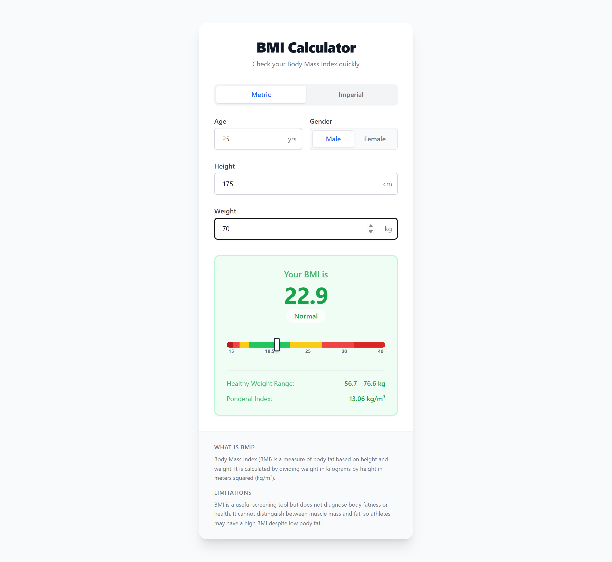
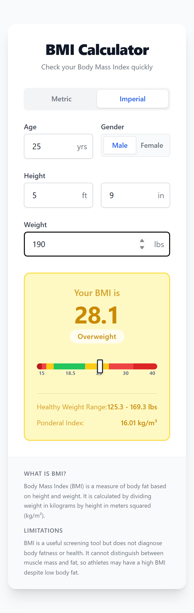

# BMI Calculator

A fast, client-side BMI (Body Mass Index) calculator built with React, TypeScript, Vite and Tailwind CSS. It calculates as you type, works in Metric or Imperial units, and shows where your result sits on a color-coded scale.

**Live demo:** https://ajayvijaykamble.github.io/BMI-Calculator_/

## Screenshots

| Desktop (Metric) | Mobile (Imperial) |
|---|---|
|  |  |

## Features

- **Real-time calculation**: BMI updates as you type, with no submit button.
- **Metric and Imperial units**: cm / kg, or ft + in / lbs.
- **Age and gender inputs**: shows a note for users under 20, where adult BMI categories are less reliable.
- **8-tier WHO classification**, from Severe Thinness to Obese Class III, color-coded.
- **Visual BMI scale** with a marker showing where your result falls (15–40).
- **Healthy weight range** for your height (BMI 18.5–25), shown in your chosen unit.
- **Ponderal Index** (kg/m³) as an additional body-shape metric.
- **Responsive** layout for mobile and desktop.
- **Private**: runs entirely in the browser. Nothing is stored or sent anywhere.

## Tech Stack

| Layer | Technology |
|---|---|
| Framework | React 19 |
| Language | TypeScript |
| Build tool | Vite |
| Styling | Tailwind CSS |
| Linting | Oxlint |
| Hosting | GitHub Pages (via GitHub Actions) |

## BMI Formula & Categories

```
BMI            = weight (kg) / height (m)²
Ponderal Index = weight (kg) / height (m)³
```

Imperial inputs are converted to metric before calculation.

| Category | BMI Range |
|---|---|
| Severe Thinness | < 16 |
| Moderate Thinness | 16 – 17 |
| Mild Thinness | 17 – 18.5 |
| Normal | 18.5 – 25 |
| Overweight | 25 – 30 |
| Obese Class I | 30 – 35 |
| Obese Class II | 35 – 40 |
| Obese Class III | ≥ 40 |

## Project Structure

```
bmi-calculator/
├── .github/workflows/deploy.yml   # Builds and deploys to GitHub Pages
├── docs/screenshots/              # README screenshots
├── public/
├── src/
│   ├── components/
│   │   ├── BMIForm.tsx            # Age, gender, height and weight inputs
│   │   ├── BMIResult.tsx          # BMI value, category, scale and extra metrics
│   │   └── UnitToggle.tsx         # Metric / Imperial switch
│   ├── hooks/
│   │   └── useBMICalculator.ts    # State and calculation logic
│   ├── types/
│   │   └── bmi.types.ts           # Types and BMI category definitions
│   ├── utils/
│   │   └── bmiUtils.ts            # Pure functions: BMI, category, conversions, ranges
│   ├── App.tsx
│   ├── main.tsx
│   └── index.css
├── index.html
├── package.json
├── tailwind.config.js
└── vite.config.ts
```

## Getting Started

### Prerequisites

- Node.js 20+ and npm

### Install and run

```bash
git clone https://github.com/AjayVijayKamble/BMI-Calculator_.git
cd BMI-Calculator_
npm install
npm run dev
```

Open the URL Vite prints (by default http://localhost:5173/BMI-Calculator_/).

### Other scripts

```bash
npm run build     # Type-check and build to dist/
npm run preview   # Serve the production build locally
npm run lint      # Run Oxlint
```

## Deployment

Every push to `main` triggers the [Deploy to GitHub Pages](.github/workflows/deploy.yml) workflow, which builds the app and publishes `dist/` to GitHub Pages.

The site is served from the `/BMI-Calculator_/` sub-path, which is set by `base` in [vite.config.ts](vite.config.ts). If you fork or rename the repository, update `base` to match the new repository name.

## Disclaimer

This tool is for general information only and is not medical advice. BMI does not distinguish between muscle and fat, so consult a healthcare professional for a proper health assessment.

## License

MIT
